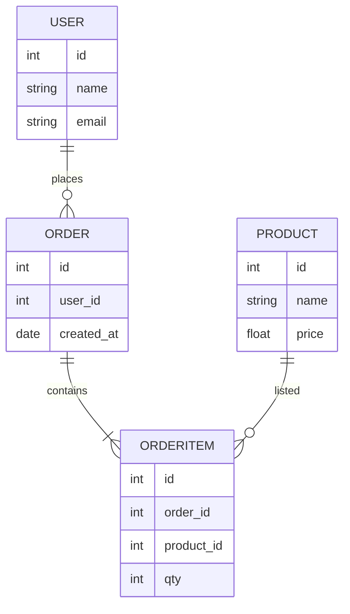
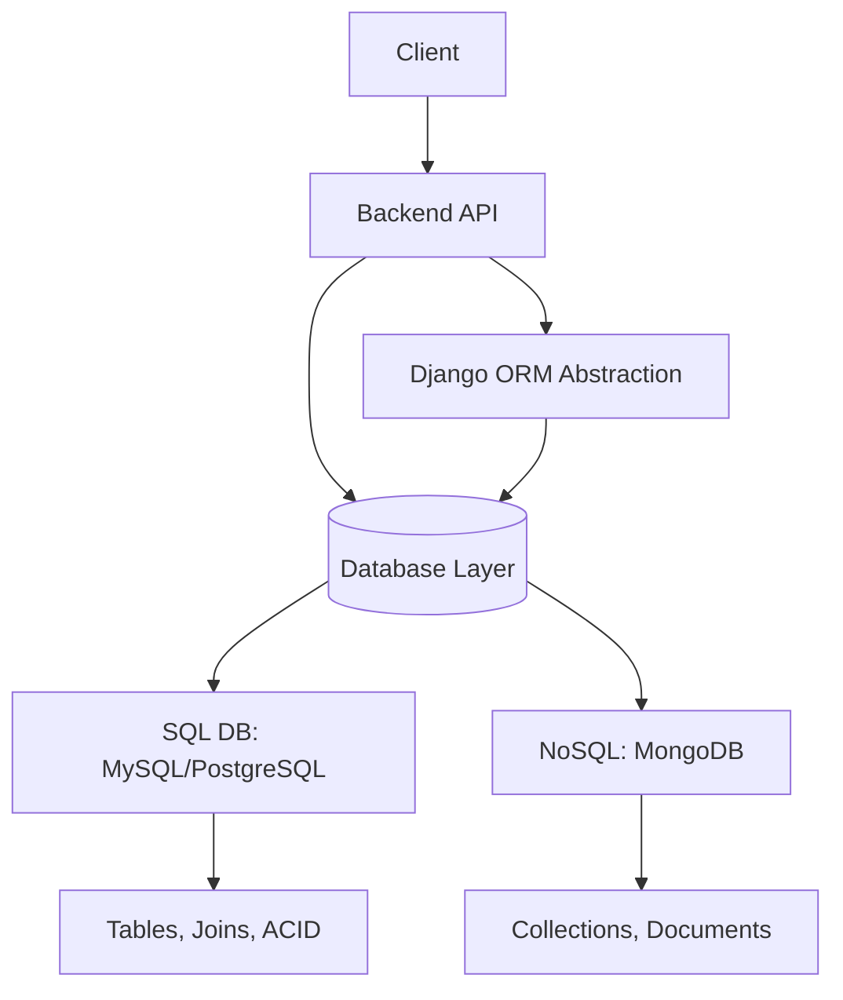

# 📘 **Ultimate Database Cheat Sheet**

### **SQL • MySQL • PostgreSQL • Django ORM • NoSQL**

<p align="center">
  
</p>

A complete, developer-focused cheat sheet that covers SQL, MySQL, PostgreSQL, MongoDB (NoSQL), and Django ORM — with commands, examples, architecture diagrams, use cases, pros/cons, and real-life references.

---

## 🏅 **Badges**


---

## 📚 **Table of Contents**

1. [Introduction](#introduction)
2. [Overview](#overview)
3. [ERD Diagram](#erd-diagram)
4. [Architecture](#architecture)
5. [SQL Cheat Sheet](#sql-cheat-sheet)
6. [MySQL Cheat Sheet](#mysql-cheat-sheet)
7. [PostgreSQL Cheat Sheet](#postgresql-cheat-sheet)
8. [NoSQL Cheat Sheet](#nosql-cheat-sheet)
9. [Django ORM Cheat Sheet](#django-orm-cheat-sheet)
10. [Use Cases](#use-cases)
11. [Pros & Cons](#pros--cons)
12. [Which Database Should You Use?](#which-db-to-use)
13. [Real-Life Examples](#real-life-examples)

---

# 🧠 **Introduction**

Databases power everything — from banking systems to social media and large AI pipelines.
This repository gives you a **single place** to reference:

✔ SQL commands
✔ MySQL & PostgreSQL features
✔ NoSQL (MongoDB) commands
✔ Django ORM Python examples
✔ ERDs, diagrams, and best practices
✔ Real-life usage patterns

---

# 🔍 **Overview**

### **SQL**

Structured Query Language used for relational databases.

### **MySQL**

Fast, popular, open-source SQL database used widely in web applications.

### **PostgreSQL**

Advanced SQL database known for reliability, performance, and extensions.

### **NoSQL**

Non-relational databases used for flexibility, scalability & unstructured data.

### **Django ORM**

Queries written in Python instead of SQL.

---

# 🏛️ **ERD Diagram**

A simple Entity Relationship Diagram used in many examples:



---

# 🧩 **Architecture**



---

# 📘 **SQL Cheat Sheet**


Basic SQL syntax applies to all relational databases.

---

## **🟦 Create Table**

```sql
CREATE TABLE users (
    id INT PRIMARY KEY,
    name VARCHAR(100),
    email VARCHAR(100) UNIQUE
);
```

---

## **🟦 Insert Data**

```sql
INSERT INTO users (id, name, email)
VALUES (1, 'Alice', 'alice@example.com');
```

---

## **🟦 Select**

```sql
SELECT name, email FROM users WHERE id = 1;
```

---

## **🟦 Update**

```sql
UPDATE users SET name = 'Alice Updated' WHERE id = 1;
```

---

## **🟦 Delete**

```sql
DELETE FROM users WHERE id = 1;
```

---

## **🟦 Joins**

```sql
SELECT orders.id, users.name
FROM orders
JOIN users ON orders.user_id = users.id;
```


---

# 🟦 **MySQL Cheat Sheet**

### Special MySQL features

## **Show Databases**

```sql
SHOW DATABASES;
```

## **Auto Increment**

```sql
CREATE TABLE items (
    id INT AUTO_INCREMENT PRIMARY KEY,
    item_name VARCHAR(100)
);
```

## **Limit**

```sql
SELECT * FROM users LIMIT 10;
```

## **Export Database**

```bash
mysqldump -u root -p dbname > backup.sql
```

---

# 🟪 **PostgreSQL Cheat Sheet**

---

## **Connect**

```bash
psql -U postgres
```

## **Create Database**

```sql
CREATE DATABASE company;
```

## **Return JSON**

```sql
SELECT row_to_json(users) FROM users;
```

## **Case-insensitive Match (ILIKE)**

```sql
SELECT * FROM users WHERE name ILIKE '%john%';
```

## **Array Column**

```sql
ALTER TABLE users ADD COLUMN tags TEXT[];
```

---

# 🟩 **NoSQL (MongoDB) Cheat Sheet**

---

## **Insert**

```js
db.users.insertOne({ name: "Alice", age: 22 })
```

## **Find**

```js
db.users.find({ age: { $gt: 20 } })
```

## **Update**

```js
db.users.updateOne({ name: "Alice" }, { $set: { age: 23 } })
```

## **Delete**

```js
db.users.deleteOne({ name: "Alice" })
```

## **Aggregation**

```js
db.orders.aggregate([
  { $match: { status: "completed" }},
  { $group: { _id: "$user_id", total: { $sum: "$amount" }}}
])
```

---

# 🟦 **Django ORM Cheat Sheet (FULL VERSION)**

Below is the **most complete Django ORM cheat sheet** for CRUD, joins, filters, annotations, raw queries, and aggregations.

---

# 🔻 **Create (C in CRUD)**

```python
user = User.objects.create(name="Alice", email="alice@example.com")
```

---

# 🔻 **Read (R in CRUD)**

### Get single object

```python
User.objects.get(id=1)
```

### Filter

```python
User.objects.filter(age__gte=18)
```

### Exclude

```python
User.objects.exclude(status="inactive")
```

### Order By

```python
User.objects.order_by('-created_at')
```

---

# 🔻 **Update (U in CRUD)**

```python
User.objects.filter(id=1).update(name="New Name")
```

---

# 🔻 **Delete (D in CRUD)**

```python
User.objects.filter(id=1).delete()
```

---

# 🔻 **Joins (select_related + prefetch_related)**

### One-to-many (ForeignKey)

```python
orders = Order.objects.select_related("user").all()
```

### Many-to-many

```python
products = Product.objects.prefetch_related("categories")
```

---

# 🔻 **Aggregations**

```python
from django.db.models import Sum, Count

Order.objects.aggregate(total_amount=Sum("amount"))
User.objects.annotate(order_count=Count("order"))
```

---

# 🔻 **Annotations**

```python
from django.db.models import F

Order.objects.annotate(
    total_price = F("qty") * F("product__price")
)
```

---

# 🔻 **Q Objects (complex queries)**

```python
from django.db.models import Q

User.objects.filter(
    Q(name__icontains="a") |
    Q(email__icontains="gmail")
)
```

---

# 🔻 **Raw SQL**

```python
User.objects.raw("SELECT * FROM users WHERE age > 25")
```

---

# 🔻 **Subqueries**

```python
from django.db.models import Subquery, OuterRef

latest_order = Order.objects.filter(
    user_id=OuterRef('id')
).order_by('-created_at')

User.objects.annotate(
    last_order_id=Subquery(latest_order.values('id')[:1])
)
```

---

# 🔻 **Bulk Create**

```python
User.objects.bulk_create([
    User(name="A"),
    User(name="B")
])
```

---

# 🎯 **Use Cases**


| Database            | Perfect For                               |
| ------------------- | ----------------------------------------- |
| **SQL / MySQL**     | Small–medium web apps, WordPress, CRMs    |
| **PostgreSQL**      | Financial systems, analytics, big queries |
| **MongoDB (NoSQL)** | Unstructured data, JSON, large-scale apps |
| **Django ORM**      | Python/Django web apps                    |

---

# ⚖️ **Pros & Cons**


## **SQL**

✔ Structured
✔ ACID compliant
✔ Strong relationships
❌ Harder to scale horizontally

## **MySQL**

✔ Fast
✔ Great for web apps
❌ Fewer advanced features than Postgres

## **PostgreSQL**

✔ Strongest SQL engine
✔ JSON + SQL hybrid
❌ Slightly slower for simple queries

## **NoSQL**

✔ Highly scalable
✔ Schema-free
❌ No joins, weaker consistency

## **Django ORM**

✔ Easy
✔ Safe
❌ Slower than raw SQL

---

# 🧩 **Which Database Should You Use?**


| Project Type           | Best Choice                 |
| ---------------------- | --------------------------- |
| Social Media App       | **PostgreSQL + Redis**      |
| Real-time Chat         | **MongoDB**                 |
| Banking System         | **PostgreSQL**              |
| Small Business Website | **MySQL**                   |
| Python Web App         | **Django ORM + PostgreSQL** |
| IoT Data Ingestion     | **NoSQL**                   |

---

# 🔥 **Real-Life Examples**

## 1. **Creating User in SQL**

```sql
INSERT INTO users (name, email) VALUES ('Mark', 'mark@corp.com');
```

## 2. **MongoDB Example: Logging Sensor Data**

```js
db.sensors.insertOne({
  temperature: 34.5,
  created_at: new Date()
})
```

## 3. **Django ORM Example: Fetching Orders**

```python
orders = Order.objects.filter(status="completed").select_related("user")
```

## 4. **PostgreSQL JSON Example**

```sql
SELECT info->>'email' FROM customers WHERE id = 1;
```

---
